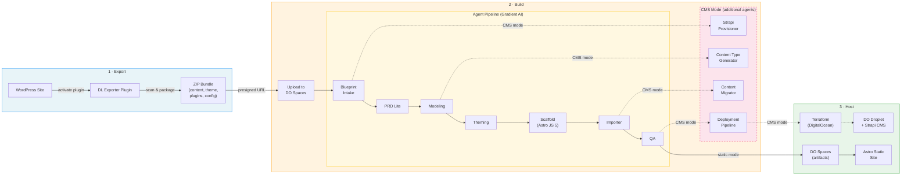

# Digital Lobster

An AI-powered platform for migrating WordPress sites to modern architectures. The project is split into two components that work together as a pipeline: an exporter that captures WordPress site data, and a multi-agent builder that transforms that data into a new site.

## Data Workflow



## Architecture

### Digital Lobster Exporter

A WordPress plugin that scans a live site and packages its structure, content samples, theme files, plugin metadata, and configuration into a ZIP bundle. No data leaves the server — the bundle is downloaded locally by the site admin.

Key traits:
- Zero-config — activate and click "Migrate"
- Privacy-first — automatically strips PII, credentials, and secrets
- Sample-based — exports representative content, not full databases
- Extensible — filters and actions for custom scanners and data transforms

See [`digital-lobster-exporter/README.md`](digital-lobster-exporter/README.md) for installation, usage, and hook reference.

### Digital Lobster Builder

A Python service that receives the export bundle and runs it through a sequential agent pipeline powered by DigitalOcean Gradient AI Platform. Each agent handles one concern (analysis, modeling, theming, scaffolding, etc.) and passes artifacts to the next.

Two pipeline modes:

**Static mode** (7 agents) — produces an Astro JS 5 static site:

1. Blueprint Intake — parse and index the export bundle
2. PRD Lite — generate a lightweight product requirements doc
3. Modeling — define content models and relationships
4. Theming — produce design tokens and layout specs
5. Scaffold — generate the Astro project structure
6. Importer — migrate content into the new structure
7. QA — validate the output

**CMS mode** (11 agents) — adds Strapi CMS integration:

1. Blueprint Intake
2. Strapi Provisioner — spin up a Strapi instance via Terraform on DigitalOcean
3. PRD Lite
4. Modeling
5. Content Type Generator — create Strapi content types from models
6. Theming
7. Scaffold
8. Importer
9. Content Migrator — push content into Strapi via its API
10. QA
11. Deployment Pipeline — finalize and deploy

See [`digital-lobster-builder/README.md`](digital-lobster-builder/README.md) for more detail.

## Getting Started

### Prerequisites

- PHP 7.4+ and a WordPress 5.9+ installation (for the exporter)
- Python 3.11+ and [uv](https://docs.astral.sh/uv/) (for the builder)
- A DigitalOcean account with Gradient AI and Spaces access
- Terraform (for CMS mode infrastructure provisioning)

### 1. Export from WordPress

1. Install the `digital-lobster-exporter` plugin on your WordPress site
2. Navigate to **🧠 Migrate with AI Agents** in the admin sidebar
3. Click **Migrate** and download the resulting ZIP bundle

### 2. Set up the Builder

```bash
cd digital-lobster-builder
cp .env.example .env
# Fill in your DigitalOcean credentials in .env
uv sync
```

### 3. Run the API

```bash
cd digital-lobster-builder
uv run uvicorn src.api.app:app --host 0.0.0.0 --port 8000
```

### 4. Trigger a migration

```bash
# Get a presigned upload URL
curl -X POST http://localhost:8000/uploads/presign \
  -H "Content-Type: application/json" \
  -d '{"filename": "migration-artifacts.zip"}'

# Upload the bundle to the returned URL, then trigger the run
curl -X POST http://localhost:8000/migrations \
  -H "Content-Type: application/json" \
  -d '{"bundle_key": "<bundle_key_from_presign>"}'

# Poll status
curl http://localhost:8000/migrations/<run_id>
```

## Configuration

### Builder environment variables

| Variable | Description |
|---|---|
| `GRADIENT_API_KEY` | DigitalOcean Gradient AI Platform API key |
| `DO_SPACES_KEY` | Spaces access key |
| `DO_SPACES_SECRET` | Spaces secret key |
| `DO_SPACES_REGION` | Spaces region |
| `DO_SPACES_INGESTION_BUCKET` | Bucket for uploaded bundles |
| `DO_SPACES_ARTIFACTS_BUCKET` | Bucket for pipeline output artifacts |

### Exporter settings

Configurable via the inline settings panel on the **🧠 Migrate with AI Agents** page in WordPress admin:
- Max posts/pages/CPT samples
- HTML snapshot toggle
- Auto-cleanup interval
- Batch size

## Development

### Builder

```bash
cd digital-lobster-builder
uv sync
uv run pytest
```

### Exporter

```bash
cd digital-lobster-exporter
composer install
vendor/bin/phpunit
```

## Project Structure

```
.
├── digital-lobster-exporter/    # WordPress plugin (PHP)
│   ├── includes/
│   │   ├── scanners/            # 23 scanner classes
│   │   ├── class-exporter.php
│   │   ├── class-packager.php
│   │   └── class-scanner.php
│   ├── templates/
│   └── tests/
│
├── digital-lobster-builder/     # Agent pipeline (Python)
│   ├── src/
│   │   ├── agents/              # Pipeline agent implementations
│   │   ├── api/                 # FastAPI routes and schemas
│   │   ├── gradient/            # Gradient AI client and tracing
│   │   ├── models/              # Pydantic data models
│   │   ├── orchestrator/        # Pipeline orchestration and state
│   │   ├── serialization/       # Markdown/MDX/frontmatter output
│   │   ├── storage/             # DigitalOcean Spaces client
│   │   └── utils/               # Credential scrubbing, helpers
│   ├── terraform/               # Strapi infrastructure (CMS mode)
│   └── tests/
│
└── README.md
```

## License

The exporter plugin is licensed under GPL v2 or later. See [`digital-lobster-exporter/LICENSE`](digital-lobster-exporter/LICENSE) for details.
